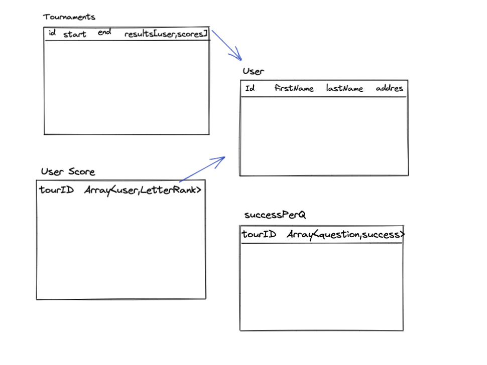

# Tournament-stats

A tournament is a multiplayer game, comprised of several rounds. Each round has 10 of multi-choice questions that comprise it which users need to answer. Essentially a tournament like a multiplayer game of "Who wants to be a Millionaire". After the tournament has finished, the Tournaments Service sends the results of the tournament via an API call to a Tournament Statistics Service. This service receives the tournament results and exposes several other APIs which allow to fetch some statistics on a given tournament.

* [Backend app](https://github.com/Danielg212/tournament-stats-/tree/master/api)


## Technologies used:
  - node
  - express
  - mongoose

## How to engage the app:


In order to launch the development session, follow these instructions:

1. First download/clone this repository
2. Open a new terminal, and change directory (cd) to `/tournament-stats`
3. Run `npm install` to get all dependencies
4. Run `npm start` and the server should be running, connected to the database


## API HTTP routes

* Since we are using MongoDB the primary keys/Ids are type of [mongoose.Schema.Types.ObjectId](https://docs.mongodb.com/manual/reference/bson-types/#std-label-objectid)

#### Post `/saveTournamentResults`

###### body:

> {<br />
&nbsp;&nbsp;   startDate: { type: Date, required: true },<br />
&nbsp;&nbsp; endDateTime: { type: Date, required: true },<br />
&nbsp;&nbsp; results: [<br />
&nbsp;&nbsp; &nbsp;&nbsp; {<br />
&nbsp;&nbsp; &nbsp;&nbsp; userId:mongoose.Schema.Types.ObjectId,<br />
&nbsp;&nbsp; &nbsp;&nbsp; correctQuestions: [Number],<br />
&nbsp;&nbsp; &nbsp;&nbsp; incorrectQuestions: [Number],<br />
&nbsp;&nbsp; &nbsp;&nbsp; }
&nbsp;&nbsp; <br />
> &nbsp;&nbsp; ],<br />
}<br />


for example:

 **POST  localhost:5000/api/saveTournamentResults**
```json
{
   "startDate": "2020-12-03T09:35:35+00:00",
   "endDateTime": "2020-12-03T12:35:35+00:00",
   "results": [{
                   "userId": "61bf268f5c8823fb8106cdb6",
                   "correctQuestions": [1,2,3,4,5,6],
                   "incorrectQuestions": [7,8,9,10]
               },
               {
                   "userId": "61bf27145c8823fb8106cdb7",
                   "correctQuestions": [1,2,3,4,5,6,8,7,10],
                   "incorrectQuestions": [9]
               },
               {
                   "userId": "61bf273c5c8823fb8106cdb8",
                   "correctQuestions": [1],
                   "incorrectQuestions": [2,3,4,5,6,7,8,9,10]
               },
               {
                   "userId": "61bf275f5c8823fb8106cdb9",
                   "correctQuestions": [3,6,10],
                   "incorrectQuestions": [2,4,5,7,8,9]
               }]
}

```

<br>

#### Get `/getTournamentResults`

###### params:

> :tournamentId === mongoose.Schema.Types.ObjectId

#### Get `/fetchSuccessPerQuestion`

###### params:

> :tournamentId === mongoose.Schema.Types.ObjectId


#### Get `/fetchUsersScores`

###### params:

> :tournamentId === mongoose.Schema.Types.ObjectId


#### Get `/fetchTournamentStatistics`

###### params:

> :tournamentId === mongoose.Schema.Types.ObjectId




P.S. You need the credentials for the `MONGO_URI` in order to connect to db.
